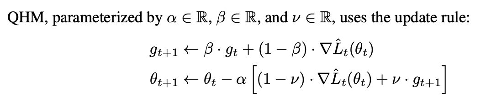

# PaddlePaddle_QHM
The implementation of QHM optimizer using PaddlePaddle

# What is QHM

The original paper is [paper](https://arxiv.org/pdf/1810.06801)

The original code repository is [code](https://github.com/facebookresearch/qhoptim/)

# How to use the QHM optimizer

<pre>
<code>
from qhm import QHM
optim = QHM(learning_rate=0.001, parameters=model.parameters())
</code>
</pre>
